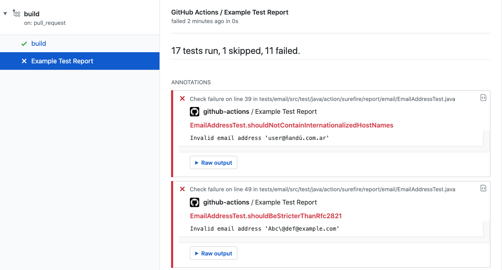

<div align="center">
  :octocat:
</div>
<h1 align="center">
  action-junit-report
</h1>

<p align="center">
    ... reports JUnit test results as GitHub pull request check.
</p>

<div align="center">
  <a href="https://github.com/mikepenz/action-junit-report">
		
	</a>
</div>
<br />

-------

## GitHub Action: Process junit reports

This action processes junit XML reports on pull requests and shows the result as a PR check with summary and annotations.
If you are looking for surefire reporting check out the amazing plugin by [ScaCap - action-surefire-report](https://github.com/ScaCap/action-surefire-report)

### Inputs

| **Input**      | **Description**                                                                                                                                                    |
|----------------|--------------------------------------------------------------------------------------------------------------------------------------------------------------------|
| `github_token` | **Required**. Usually in form of `github_token: ${{ secrets.GITHUB_TOKEN }}`.                                                                                      |
| `report_paths` | **Required**. [Glob](https://github.com/actions/toolkit/tree/master/packages/glob) expression to junit report paths. The default is `**/junit-reports/TEST-*.xml`. |
| `check_name`   | Optional. Check name to use when creating a check run. The default is `Test Report`.                                                                               |
| `commit`       | Optional. The commit SHA to update the status. This is useful when you run it with `workflow_run`.                                                                 |

### Example usage

```yml
name: build
on:
  pull_request:

jobs:
  build:
    name: Build and Run Tests
    runs-on: ubuntu-latest
    steps:
      - name: Checkout Code
        uses: actions/checkout@v1
      - name: Build and Run Tests
        run: # execute your tests generating test results
      - name: Publish Test Report
        uses: mikepenz/action-junit-report@v1
        with:
          report_paths: '**/build/test-results/test/TEST-*.xml'
          github_token: ${{ secrets.GITHUB_TOKEN }}
```

### Note

Forked from: https://github.com/ScaCap/action-surefire-report

## Sample



## Contribute

```bash
# Install the dependencies  
$ npm install

# Build and package it for distribution
$ ncc build index.js --license licenses.txt

# Run the tests, use to debug, and test it out
$ npm run test

# Verify lint is happy
$ npm run eslint
```

## License

    Copyright 2020 ScaCap
    Modifications Copyright (C) 2021 Mike Penz

    Licensed under the Apache License, Version 2.0 (the "License");
    you may not use this file except in compliance with the License.
    You may obtain a copy of the License at

       http://www.apache.org/licenses/LICENSE-2.0

    Unless required by applicable law or agreed to in writing, software
    distributed under the License is distributed on an "AS IS" BASIS,
    WITHOUT WARRANTIES OR CONDITIONS OF ANY KIND, either express or implied.
    See the License for the specific language governing permissions and
    limitations under the License.
