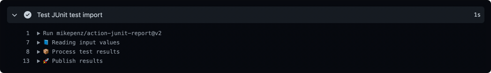
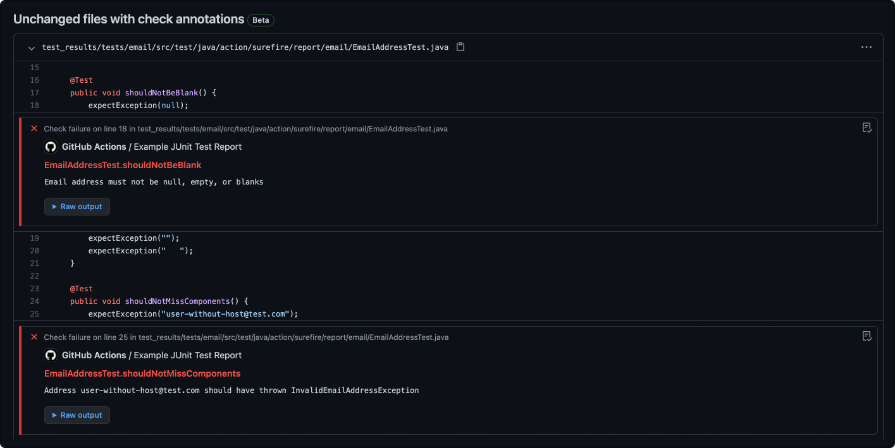
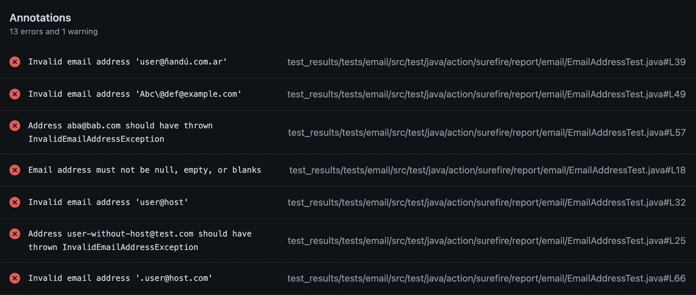

<div align="center">
  :octocat:
</div>
<h1 align="center">
  action-junit-report
</h1>

<p align="center">
    ... reports JUnit test results as GitHub pull request check.
</p>

<div align="center">
  
</div>

<div align="center">
  <a href="https://github.com/mikepenz/action-junit-report">
		
	</a>
</div>
<br />

-------

<p align="center">
    <a href="#whats-included-">What's included 🚀</a> &bull;
    <a href="#setup">Setup 🛠️</a> &bull;
    <a href="#sample-%EF%B8%8F">Sample 🖥️</a> &bull;
    <a href="#contribute-">Contribute 🧬</a> &bull;
    <a href="#license">License 📓</a>
</p>

-------

### What's included 🚀

- Flexible JUnit parser with wide support
- Supports nested test suites
- Blazingly fast execution
- Lighweight
- Rich build log output

This action processes JUnit XML test reports on pull requests and shows the result as a PR check with summary and annotations.

Based on action for [Surefire Reports by ScaCap](https://github.com/ScaCap/action-surefire-report)

## Setup

### Configure the workflow

```yml
name: build
on:
  pull_request:

jobs:
  build:
    name: Build and Run Tests
    runs-on: ubuntu-latest
    steps:
      - name: Checkout Code
        uses: actions/checkout@v1
      - name: Build and Run Tests
        run: # execute your tests generating test results
      - name: Publish Test Report
        uses: mikepenz/action-junit-report@v3
        if: always() # always run even if the previous step fails
        with:
          report_paths: '**/build/test-results/test/TEST-*.xml'
```

### Inputs

| **Input**      | **Description**                                                                                                                                                       |
|----------------|-----------------------------------------------------------------------------------------------------------------------------------------------------------------------|
| `report_paths`    | **Required**. [Glob](https://github.com/actions/toolkit/tree/master/packages/glob) expression to junit report paths. The default is `**/junit-reports/TEST-*.xml`. |
| `token`           | Optional. GitHub token for creating a check run. Set to `${{ github.token }}` by default.                                                                          |
| `test_files_prefix` | Optional. Prepends the provided prefix to test file paths within the report when annotating on GitHub.                                                           |
| `exclude_sources` | Optional. Provide `,` seperated array of folders to ignore for source lookup. Defaults to: `/build/,/__pycache__/`                                                 |
| `check_name`      | Optional. Check name to use when creating a check run. The default is `JUnit Test Report`.                                                                         |
| `suite_regex`     | Optional. Regular expression for the named test suites. E.g. `Test*`                                                                                               |
| `commit`          | Optional. The commit SHA to update the status. This is useful when you run it with `workflow_run`.                                                                 |
| `fail_on_failure` | Optional. Fail the build in case of a test failure.                                                                                                                |
| `require_tests`   | Optional. Fail if no test are found.                                                                                                                               |
| `include_passed`   | Optional. By default the action will skip passed items for the annotations. Enable this flag to include them.                                                                                                                               |
| `check_retries`         | Optional. If a testcase is retried, ignore the original failure.                                                                                             |
| `check_title_template`  | Optional. Template to configure the title format. Placeholders: {{FILE_NAME}}, {{SUITE_NAME}}, {{TEST_NAME}}.                                                |
| `summary`         | Optional. Additional text to summary output                                                                                                                        |
| `update_check`    | Optional. Uses an alternative API to update checks, use for cases with more than 50 annotations. Default: `false`.                                                                  |
| `annotate_only`   | Optional. Will only annotate the results on the files, won't create a check run. Defaults to `false`.                                                                                  |
| `transformers`    | Optional. Array of `Transformer`s offering the ability to adjust the fileName. Defaults to: `[{"searchValue":"::","replaceValue":"/"}]`                            |
| `job_summary`     | Optional. Enables the publishing of the job summary for the results. Defaults to `true`. May be required to disable [Enterprise Server](https://github.com/mikepenz/action-junit-report/issues/637)                           |
| `detailed_summary`    | Optional. Include table with all test results in the summary. Defaults to `false`.                            |
| `annotate_notice`    | Optional. Annotate passed test results along with warning/failed ones. Defaults to `false`. (Changed in v3.5.0)                           |

### Action outputs

After action execution it will return the test counts as output.

```yml
# ${{steps.{CHANGELOG_STEP_ID}.outputs.total}}
```

A full set list of possible output values for this action.

| **Output**            | **Description**                                                                        |
|-----------------------|----------------------------------------------------------------------------------------|
| `outputs.total`       | The total number of test cases covered by this test-step.                              |
| `outputs.passed`      | The number of passed test cases.                                                       |
| `outputs.skipped`     | The number of skipped test cases.                                                      |
| `outputs.failed`      | Then umber of failed test cases.                                                       |

### PR run permissions

For [security reasons], the github token used for `pull_request` workflows is [maxed at read-only].
If you want to post checks to a PR from an external repository, you will need to use a separate workflow
which has a read/write token, or use a PAT with elevated permissions. 

[security reasons]: https://securitylab.github.com/research/github-actions-preventing-pwn-requests/
[maxed at read-only]: https://docs.github.com/en/actions/security-guides/automatic-token-authentication#permissions-for-the-github_token

<details><summary><b>Example</b></summary>
<p>

```yml
name: build
on:
  pull_request:

jobs:
  build:
    name: Build and Run Tests
    runs-on: ubuntu-latest
    steps:
      - name: Checkout Code
        uses: actions/checkout@v3
      - name: Build and Run Tests
        run: # execute your tests generating test results
      - name: Upload Test Report
        uses: actions/upload-artifact@v3
        if: always() # always run even if the previous step fails
        with:
          name: junit-test-results
          path: '**/build/test-results/test/TEST-*.xml'
          retention-days: 1

---
name: report
on:
  workflow_run:
    workflows: [build]
    types: [completed]
    
permissions:
  checks: write

jobs:
  checks:
    runs-on: ubuntu-latest
    steps:
      - name: Download Test Report
        uses: dawidd6/action-download-artifact@v2
        with:
          name: junit-test-results
          workflow: ${{ github.event.workflow.id }}
          run_id: ${{ github.event.workflow_run.id }}
      - name: Publish Test Report
        uses: mikepenz/action-junit-report@v3
        with:
          commit: ${{github.event.workflow_run.head_sha}}
          report_paths: '**/build/test-results/test/TEST-*.xml'
```

This will securely post the check results from the privileged workflow onto the PR's checks report. 

</p>
</details>

## Sample 🖥️

<div align="center">
  
</div>

<div align="center">
  
</div>

## Contribute 🧬

```bash
# Install the dependencies  
$ npm install

# Verify lint is happy
$ npm run lint -- --fix

# Build the typescript and package it for distribution
$ npm run build && npm run package

# Run the tests, use to debug, and test it out
$ npm test
```

### Credits

Original idea and GitHub Actions by: https://github.com/ScaCap/action-surefire-report

## Other actions

- [release-changelog-builder-action](https://github.com/mikepenz/release-changelog-builder-action)
- [xray-action](https://github.com/mikepenz/xray-action/)
- [jira-release-composition-action](https://github.com/mikepenz/jira-release-composite-action)

## License

    Copyright (C) 2022 Mike Penz

    Licensed under the Apache License, Version 2.0 (the "License");
    you may not use this file except in compliance with the License.
    You may obtain a copy of the License at

       http://www.apache.org/licenses/LICENSE-2.0

    Unless required by applicable law or agreed to in writing, software
    distributed under the License is distributed on an "AS IS" BASIS,
    WITHOUT WARRANTIES OR CONDITIONS OF ANY KIND, either express or implied.
    See the License for the specific language governing permissions and
    limitations under the License.
